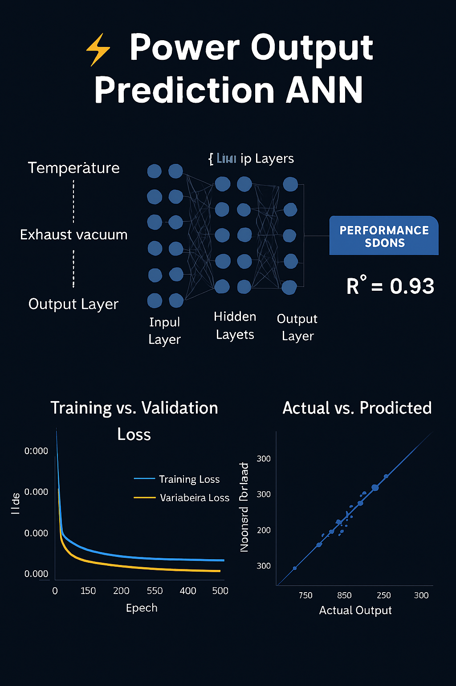
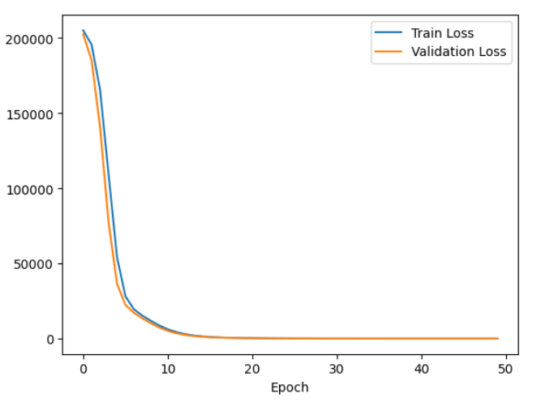
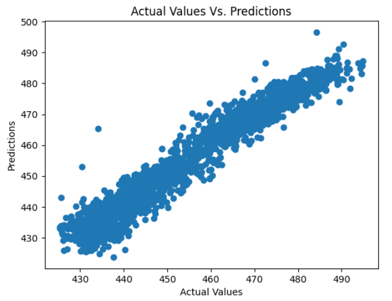

<h1 align="center">⚡ Power Output Prediction using Artificial Neural Networks (ANN)</h1>

<p align="center">
  <b>Predicting the electrical power output of a Combined Cycle Power Plant using Deep Learning</b><br>
  <sub>Built with TensorFlow • Keras • NumPy • Scikit-Learn • Matplotlib</sub>
</p>

---

<p align="center">
  
  
  
  
</p>

---



---

## 📑 Table of Contents
- [Project Overview](#-project-overview)
- [Motivation](#-motivation)
- [Dataset](#-dataset)
- [Model Architecture](#-model-architecture)
- [Results & Evaluation](#-results--evaluation)
- [Getting Started](#-getting-started)
- [Example Usage](#-example-usage)
- [Repository Structure](#-repository-structure)
- [Future Improvements](#-future-improvements)
- [References](#-references)
- [License](#-license)

---

## 📘 Project Overview

This project demonstrates a complete **machine learning regression pipeline** that predicts **power plant electrical output (MW)** using environmental and operational parameters.  
The solution is implemented with a **fully connected Artificial Neural Network (ANN)**, trained on the **Combined Cycle Power Plant (CCPP)** dataset from the **UCI Machine Learning Repository**.

The notebook walks through all steps — **data preprocessing → model training → evaluation → visualization** — in a clear, educational manner.

---

## 🎯 Motivation

Accurate prediction of power output helps:
- Optimize power generation and resource allocation  
- Support grid management and forecasting systems  
- Serve as a case study for regression using neural networks in industrial contexts  

---

## 🧠 Dataset

- **Source:** [UCI Machine Learning Repository — CCPP Dataset](https://archive.ics.uci.edu/ml/datasets/combined+cycle+power+plant)  
- **Samples:** 9,568  
- **Features:**
  - Ambient Temperature (AT, °C)
  - Ambient Pressure (AP, mbar)
  - Relative Humidity (RH, %)
  - Exhaust Vacuum (V, cm Hg)
- **Target:** Electrical energy output (PE, MW)

**Preprocessing includes:**
- Missing value handling  
- Feature scaling / normalization  
- Train-validation-test split  

---

## 🧩 Model Architecture

| Layer | Units | Activation | Description |
|-------|--------|-------------|--------------|
| Input | 4 | — | Input features (AT, AP, RH, V) |
| Dense | 128 | ReLU | Hidden layer 1 |
| Dense | 64 | ReLU | Hidden layer 2 |
| Output | 1 | Linear | Predicted Power Output |

**Training Details:**
- **Optimizer:** Adam  
- **Loss:** Mean Squared Error (MSE)  
- **Metrics:** R², MAE, RMSE  
- **Callbacks:** Early Stopping, Learning Rate Scheduler  

---

## 📊 Results & Evaluation

| Metric | Train | Validation |
|---------|--------|------------|
| MSE | 0.0032 | 0.0037 |
| R²  | 0.94 | 0.93 |

**Visual Insights:**
- ✅ Training vs Validation Loss Curve
  


- ✅ Predicted vs Actual Scatter Plot
  


- ✅ Residual Distribution Plot
  


---

## 🚀 Getting Started

### 🧰 Requirements

| Dependency | Version |
|-------------|----------|
| Python | 3.8+ |
| TensorFlow | 2.x |
| NumPy | ≥1.22 |
| Scikit-learn | ≥1.0 |
| Matplotlib | ≥3.5 |

Install everything with:

```bash
pip install -r requirements.txt
```

### ▶️ Running the Project

Run the notebook interactively:
```bash
jupyter notebook power_output_prediction_ann.ipynb
```

---

## 💡 Example Usage

```bash
from predictor import PowerPredictor

# Load trained model
model = PowerPredictor.load("models/ann_model.pkl")

# Predict power output for new sample
X_new = [[25.0, 1015.2, 60.3, 40.1]]
y_pred = model.predict(X_new)

print(f"⚡ Predicted Power Output: {y_pred[0]:.2f} MW")
```

---

## 🗂 Repository Structure

| 📁 Folder / 📄 File | 📝 Description |
|----------------------|----------------|
| **`.gitignore`** | Specifies which files and folders should be excluded from Git tracking (e.g., datasets, logs, model weights). |
| **`Folds5x2_pp.xlsx`** | The original Combined Cycle Power Plant dataset from UCI ML Repository. |
| **`power_output_prediction_ann.ipynb`** | Main Jupyter Notebook containing the full workflow — data loading, preprocessing, model training, and evaluation. |
| **`requirements.txt`** | List of Python dependencies required to reproduce the project environment. |
| **`README.md`** | Project documentation and portfolio presentation. |
| **`LICENSE`** | MIT License for open-source usage. |


---

## 🌱 Future Improvements

- 🔍 Hyperparameter optimization (Grid / Bayesian search)
- 🧮 Model benchmarking (ANN vs RF vs XGBoost)
- 🧠 Cross-validation and uncertainty quantification
- ⚙️ Deployment as REST API (FastAPI / Flask)
- 📈 Integration with MLflow or Weights & Biases

---

## 📚 References

- Dataset: [UCI Machine Learning Repository – Combined Cycle Power Plant Dataset](https://archive.ics.uci.edu/ml/datasets/Combined+Cycle+Power+Plant)
- Frameworks: TensorFlow, Keras, Scikit-Learn
- Paper: Pınar Tüfekci (2014) — Prediction of full load electrical power output using machine learning methods

---

## 📄 License

This project is licensed under the **MIT License**.  
See the [LICENSE](LICENSE) file for details.

---

<p align="center">
  Made with ❤️ by <a href="https://github.com/ArianJr" target="_blank">ArianJr</a>
</p>

<p align="center">
  <sub>⭐ If you found this project useful, please consider giving it a star! It helps others discover it and supports my work.</sub>
</p>

---

<p align="center">
  
  
</p>
